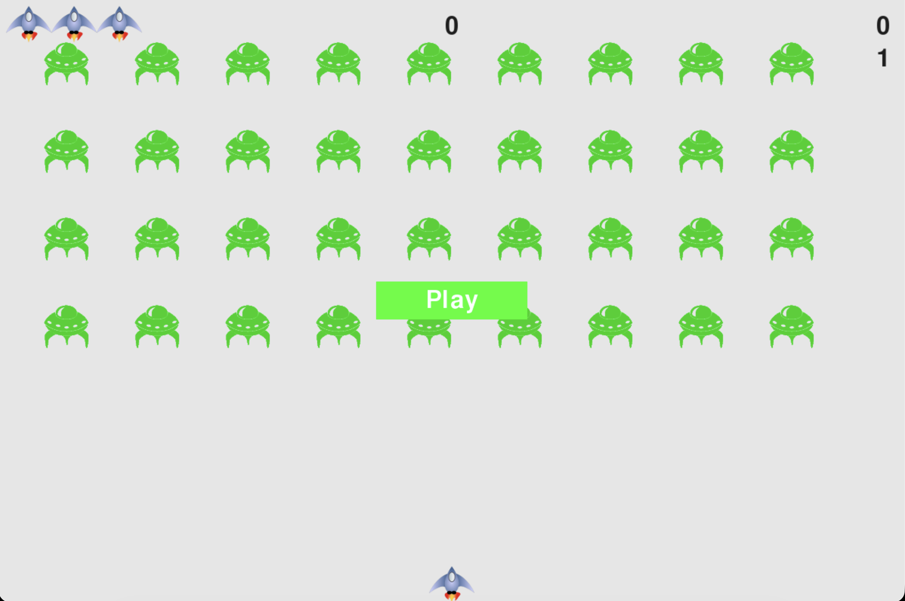

# Alien Invasion

A classic arcade-style shooter game built with Python and Pygame. Command a ship, shoot down fleets of invading aliens, and rack up high scores as the game gets progressively faster and harder!



## Features

- **Classic Gameplay:** Control a starship at the bottom of the screen and eliminate descending alien fleets.
- **Dynamic Difficulty:** The game speeds up and point values increase as you successfully destroy each wave of aliens.
- **Scoreboard:** Tracks your current score, high score, level, and remaining ships (lives).
- **Smooth Controls:** Responsive keyboard input for movement and firing.

## How to Play

- **Move Left:** Press the `Left Arrow` key
- **Move Right:** Press the `Right Arrow` key
- **Fire Laser:** Press the `Spacebar`
- **Quit Game:** Press the `Q` key or close the window
- **Start/Restart Game:** Click the **Play** button

## Getting Started

### Prerequisites

You need Python 3.x installed on your machine.

### Installation & Setup

1. Clone or download this repository.
2. Create a virtual environment:
   ```bash
   python3 -m venv .venv
   ```
3. Activate the virtual environment:
   - **macOS/Linux:**
     ```bash
     source .venv/bin/activate
     ```
   - **Windows (PowerShell):**
     ```powershell
     .venv\Scripts\Activate.ps1
     ```
   - **Windows (Command Prompt):**
     ```cmd
     .venv\Scripts\activate.bat
     ```
4. Install Pygame in your virtual environment:
   ```bash
   pip install pygame
   ```

### Running the Game

With your virtual environment active, run:
```bash
python alien_invasion.py
```